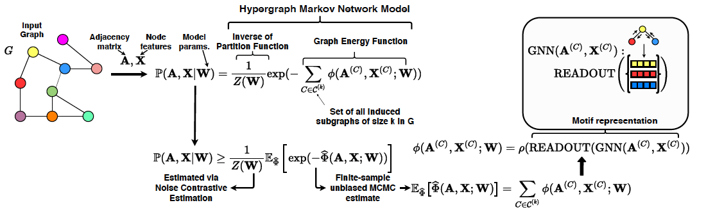

# MHM-GNN



## Setting up

Besides g++ compiler (version 5.4), we need to install the follow libraries in order to compile the sampling code

```
libboost-all-dev
libtbb-dev
libgsl-dev
libsparsehash-dev
```

To compile the C++ sampling code, you should have conda installed. We have tested the code on Ubuntu servers, thus we recommend its use, although it should work fine in other unix-based systems.

```
cd external_libs
unzip rgpm.zip
cd rgpm
./compile.sh
```

## Downloading Data

```
[PLACEHOLDER]
```

## Running Experiments

Make sure you have Python 3.x and the latest versions of Pytorch and Pytorch Geometric installed.

You can run the experiments from the original paper with the scripts [dataset]-[k].py
