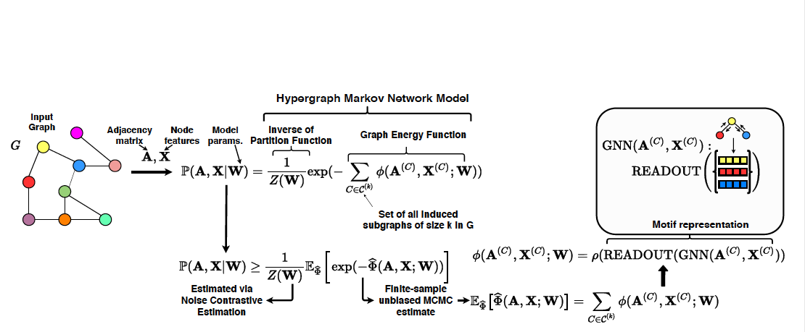

# MHM-GNN



## Setting up

To compile the C++ sampling code, you should have conda and g++ compiler (version 5.4) installed. We have tested the code on Ubuntu servers, thus we recommend its use, although it should work fine in other unix-based systems.

```
cd external_libs
unzip rgpm.zip
cd rgpm
./compile.sh
```

## Downloading Data

```
[PLACEHOLDER]
```

## Running Experiments

Make sure you have Python 3.x and the latest versions of Pytorch and Pytorch Geometric installed.

You can run the experiments from Tables 1,2,3 from the original paper with the scripts [dataset]-[k].py
